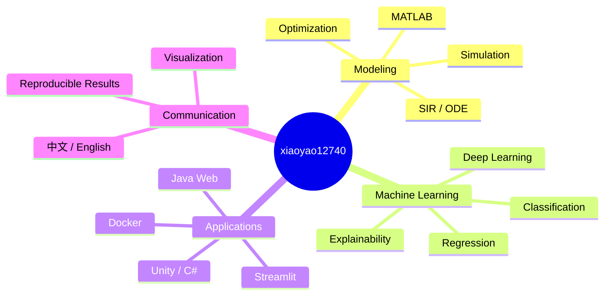

  

  <a href="README.md">中文</a> ·
  <a href="#english">English</a> ·
  <a href="https://github.com/xiaoyao12740?tab=repositories">全部项目 / All Projects</a>

## 你好，我是 xiaoyao12740 👋

我喜欢把一个想法推进成可以运行、可以验证、也可以清楚展示的完整项目。目前主要探索数学建模、机器学习、深度学习、优化算法与交互式应用。

我的仓库不仅保存代码，也尽量保留问题背景、方法设计、真实结果、复现步骤和中英双语文档。

  
  
  
  
  

### 我在做什么

| 方向 | 关注内容 |
| --- | --- |
| 🤖 机器学习 | 表格分类与回归、深度学习、模型比较、可解释性与反馈闭环 |
| 📐 数学建模 | 运筹优化、动力系统、参数估计、情景模拟与决策分析 |
| 🧩 应用开发 | Streamlit 数据应用、Unity 游戏、Java Web 与 Docker 化交付 |
| 📊 结果表达 | 可复现实验、图表报告、中英双语 README 与项目主页设计 |

## 精选项目 / Featured Projects

<table>
  <tr>
    <td width="50%" valign="top">
      <h3><a href="https://github.com/xiaoyao12740/deepvision-studio">DeepVision Studio</a></h3>
      
MNIST 深度学习工作室：训练、推理、反馈分析、再训练与实验报告。

      
<code>Python</code> <code>Deep Learning</code> <code>Streamlit</code>

    </td>
    <td width="50%" valign="top">
      <h3><a href="https://github.com/xiaoyao12740/universal-classifier">Universal Classifier</a></h3>
      
AutoML 风格表格分类平台：CSV 导入、模型比较、注册与报告。

      
<code>Python</code> <code>Classification</code> <code>Docker</code>

    </td>
  </tr>
  <tr>
    <td width="50%" valign="top">
      <h3><a href="https://github.com/xiaoyao12740/smarthouse-regression">SmartHouse Regression</a></h3>
      
双语房价回归应用：多模型对比、解释性分析、单位换算与交互预测。

      
<code>Regression</code> <code>Explainability</code> <code>Streamlit</code>

    </td>
    <td width="50%" valign="top">
      <h3><a href="https://github.com/xiaoyao12740/SIR-Respiratory-Researc">SIR Respiratory Research</a></h3>
      
呼吸道疾病传播研究：区域分波拟合、残差诊断与干预情景模拟。

      
<code>SIR</code> <code>MATLAB</code> <code>Python</code>

    </td>
  </tr>
  <tr>
    <td width="50%" valign="top">
      <h3><a href="https://github.com/xiaoyao12740/uav-smoke-screen-optimization">UAV Smoke-Screen Optimization</a></h3>
      
无人机烟幕投放策略：三维运动学、遮蔽判定与多平台协同优化。

      
<code>MATLAB</code> <code>Optimization</code> <code>Simulation</code>

    </td>
    <td width="50%" valign="top">
      <h3><a href="https://github.com/xiaoyao12740/link-link-arena">Link Link Arena</a></h3>
      
Unity 连连看竞技场：AI 对手、比赛回放、历史记录与跨平台构建。

      
<code>Unity</code> <code>C#</code> <code>Game Development</code>

    </td>
  </tr>
</table>

## 技术版图 / Technology Map

## 作品集概览 / Portfolio at a Glance

| 公开仓库 | MATLAB 项目 | Python 项目 | 应用与游戏 |
| ---: | ---: | ---: | ---: |
| **22** | **16** | **4** | **2** |

> 数字基于当前公开作品集整理；随着新项目发布会持续更新。

## English

Hi, I’m **xiaoyao12740**. I enjoy turning ideas into complete projects that can be run, verified, and communicated clearly. My current interests include mathematical modeling, machine learning, deep learning, optimization, simulation, and interactive software.

Across my repositories, I aim to keep the problem context, method, implementation, real outputs, reproduction steps, and bilingual documentation together—not just the source code.

### Current focus

- Building end-to-end classification, regression, and deep-learning workflows.
- Applying optimization and dynamical systems to practical modeling problems.
- Packaging technical work as interactive apps, visual reports, and reproducible repositories.
- Improving how project results are explained in both Chinese and English.

## 联系与浏览 / Connect & Explore

  
  

Thanks for visiting. 如果这些项目对你有帮助，欢迎 Star 或通过 Issue 交流。

