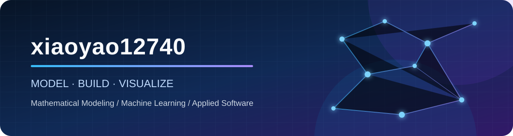

  

  <a href="#你好我是-xiaoyao12740-">中文</a> ·
  <a href="#english">English</a> ·
  <a href="https://github.com/xiaoyao12740?tab=repositories">全部项目 / All Projects</a>

## 你好，我是 xiaoyao12740 👋

我专注于**应用机器学习、数据分析工程与 AI 工程**，也保留数学建模与优化背景。我喜欢把问题推进成完整项目：定义口径、构建数据、训练或分析、验证结果、设计失败策略，并通过测试、CI、文档和可复现实验留下证据。

目前的核心作品集覆盖计算机视觉、NLP、用户价值与流失、MySQL 电商分析，以及带证据约束的本地 LLM PDF 抽取。核心项目均提供可复现实验、测试、CI 与工程验证证据。

  
  
  
  
  
  
  
  

### 能力主线

| 方向 | 我关注的工程问题 |
| --- | --- |
| 🤖 机器学习 | 时间切分、泄漏防护、模型选择、概率评估、可复现实验 |
| 📊 数据分析工程 | SQL-first 分析、MySQL 数据建模、质量门禁、指标对账与查询优化 |
| 🧠 AI 工程 | Local LLM、PDF 解析、证据绑定、拒答、Schema 与运行时失败策略 |
| 📐 数学建模 | 运筹优化、动力系统、参数估计、仿真与决策分析 |
| 🧩 工程交付 | FastAPI、Streamlit、Docker、pytest、Ruff、GitHub Actions 与双语文档 |

## 核心项目 / Flagship Projects

<table>
  <tr>
    <td width="50%" valign="top">
      <h3><a href="https://github.com/xiaoyao12740/llm-pdf-data-extraction">LLM PDF Data Extraction</a></h3>
      
规则优先、选择性调用本地 LLM 的 PDF 结构化抽取管线。实现字段专属 value↔evidence 绑定、拒答与恢复指标、严格 Schema、运行时失败策略、MySQL provenance 和迁移测试。

      
<strong>验证：</strong>受控合成基准上 59 次语义恢复、4/4 缺失值拒答；Python 3.10–3.12 + MySQL CI。

      
<a href="https://github.com/xiaoyao12740/llm-pdf-data-extraction/releases/tag/v1.0.0">Release v1.0.0</a>

      
<code>Local LLM</code> <code>PDF</code> <code>Pydantic</code> <code>MySQL</code>

    </td>
    <td width="50%" valign="top">
      <h3><a href="https://github.com/xiaoyao12740/mysql-ecommerce-user-analytics">MySQL E-commerce Analytics</a></h3>
      
SQL-first 电商用户行为分析工程，覆盖漏斗、留存、复购、RFM、商品表现和查询优化；Python 只负责生成、执行、导出与可视化，不复制业务 SQL。

      
<strong>验证：</strong>14 项阻断式 DQ 检查，商品收入与成功订单金额按分对账；CI 运行真实 MySQL 链路。

      
<a href="https://github.com/xiaoyao12740/mysql-ecommerce-user-analytics/releases/tag/v1.0.2">Release v1.0.2</a>

      
<code>MySQL 8</code> <code>SQL</code> <code>RFM</code> <code>Data Quality</code>

    </td>
  </tr>
  <tr>
    <td width="50%" valign="top">
      <h3><a href="https://github.com/xiaoyao12740/user-ltv-churn-analytics">User LTV & Churn Analytics</a></h3>
      
从 30,000 名模拟用户的行为历史构建 KPI、留存、LTV、流失风险和分群结果。训练、验证与测试按时间切分，并分别执行 90/30 天标签成熟约束。

      
<strong>验证：</strong>防止特征泄漏和未成熟标签泄漏；SQL/Pandas 收入与 MySQL 行数、孤儿记录完成对账。

      
<a href="https://github.com/xiaoyao12740/user-ltv-churn-analytics/releases/tag/v1.0.0">Release v1.0.0</a>

      
<code>Machine Learning</code> <code>Time Split</code> <code>MySQL</code> <code>Power BI</code>

    </td>
    <td width="50%" valign="top">
      <h3><a href="https://github.com/xiaoyao12740/customer-voice-intelligence">Customer Voice Intelligence</a></h3>
      
端到端客户情感分析平台：训练集 CV、验证集模型选择、锁定测试集一次评估，并提供向量化批量预测、FastAPI、Streamlit 与数据库持久化。

      
<strong>验证：</strong>最终测试 Macro F1 84.82%、ROC-AUC 92.25%；报告概率质量与 Bootstrap 区间。

      
<a href="https://github.com/xiaoyao12740/customer-voice-intelligence/releases/tag/v1.0.0">Release v1.0.0</a> · <a href="https://github.com/xiaoyao12740/customer-voice-intelligence/pkgs/container/customer-voice-intelligence">GHCR</a>

      
<code>NLP</code> <code>scikit-learn</code> <code>FastAPI</code> <code>Streamlit</code>

    </td>
  </tr>
  <tr>
    <td width="50%" valign="top">
      <h3><a href="https://github.com/xiaoyao12740/industrial-defect-classifier">Industrial Defect Classifier</a></h3>
      
基于 PyTorch 与迁移学习的工业表面缺陷分类系统，包含训练、评估、推理、双语演示和 Docker 交付。

      
<strong>验证：</strong>NEU-CLS 正式实验 Accuracy 98.52%；CI 覆盖 tiny train → checkpoint → reload → inference 闭环，并明确区分轻量 CI 与完整实验。

      
<a href="https://github.com/xiaoyao12740/industrial-defect-classifier/releases/tag/v1.0.0">Release v1.0.0</a>

      
<code>PyTorch</code> <code>Computer Vision</code> <code>Transfer Learning</code> <code>Docker</code>

    </td>
    <td width="50%" valign="top">
      <h3><a href="https://github.com/xiaoyao12740/uav-smoke-screen-optimization">UAV Smoke-Screen Optimization</a></h3>
      
无人机烟幕投放策略的数学建模项目：三维运动学、遮蔽判定、时序约束与多平台协同优化。

      
<strong>定位：</strong>展示我在机器学习与数据工程之外的建模、仿真和优化能力。

      
<code>MATLAB</code> <code>Optimization</code> <code>Simulation</code>

    </td>
  </tr>
</table>

## 更多作品

- [DeepVision Studio](https://github.com/xiaoyao12740/deepvision-studio) — MNIST 训练、推理、反馈与实验报告。
- [Universal Classifier](https://github.com/xiaoyao12740/universal-classifier) — AutoML 风格表格分类平台；已完成容器化发布适配审计。
- [SmartHouse Regression](https://github.com/xiaoyao12740/smarthouse-regression) — 表格回归与 Streamlit 推理；提供 [GHCR 镜像](https://github.com/xiaoyao12740/smarthouse-regression/pkgs/container/smarthouse-regression)。
- [SIR Respiratory Research](https://github.com/xiaoyao12740/SIR-Respiratory-Researc) — 疫情传播拟合与干预情景模拟；[DOI: 10.5281/zenodo.20267603](https://doi.org/10.5281/zenodo.20267603)。
- [Link Link Arena](https://github.com/xiaoyao12740/link-link-arena) — Unity AI 对手、回放与跨平台构建。
- [全部 29 个公开仓库](https://github.com/xiaoyao12740?tab=repositories) — 数学建模、机器学习、数据分析和应用开发作品集。

## English

Hi, I’m **xiaoyao12740**. I build auditable, reproducible projects across **applied machine learning, analytics engineering, and AI engineering**, supported by a background in mathematical modeling and optimization.

My current flagship portfolio demonstrates five distinct capabilities:

- [LLM PDF Data Extraction](https://github.com/xiaoyao12740/llm-pdf-data-extraction): local-LLM recovery with deterministic evidence grounding, abstention, validation, telemetry, and MySQL provenance.
- [MySQL E-commerce Analytics](https://github.com/xiaoyao12740/mysql-ecommerce-user-analytics): SQL-first funnel, retention, RFM, product analytics, blocking data-quality gates, and revenue reconciliation.
- [User LTV & Churn Analytics](https://github.com/xiaoyao12740/user-ltv-churn-analytics): maturity-aware temporal splits, leakage prevention, calibrated churn risk, and customer analytics.
- [Customer Voice Intelligence](https://github.com/xiaoyao12740/customer-voice-intelligence): validation-based NLP model selection, vectorized batch inference, FastAPI, Streamlit, and database persistence.
- [Industrial Defect Classifier](https://github.com/xiaoyao12740/industrial-defect-classifier): PyTorch transfer learning with a tested train-checkpoint-reload-inference lifecycle.

Across these repositories, I emphasize honest evaluation, executable data checks, explicit failure semantics, CI-tested workflows, and documentation that explains both results and limitations.

## 联系方式 / Contact

  📧 <a href="mailto:xiaoyaotongxue8@gmail.com">xiaoyaotongxue8@gmail.com</a>
  &nbsp;·&nbsp;
  <a href="https://github.com/xiaoyao12740?tab=repositories">GitHub Projects</a>

